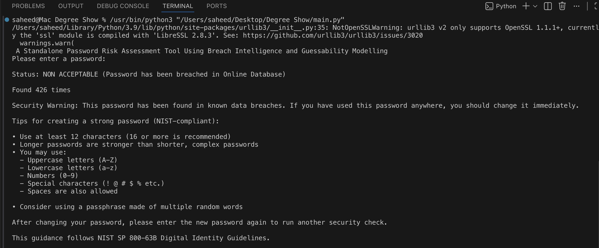
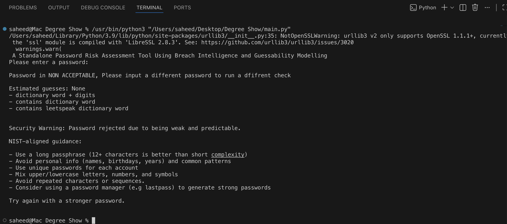
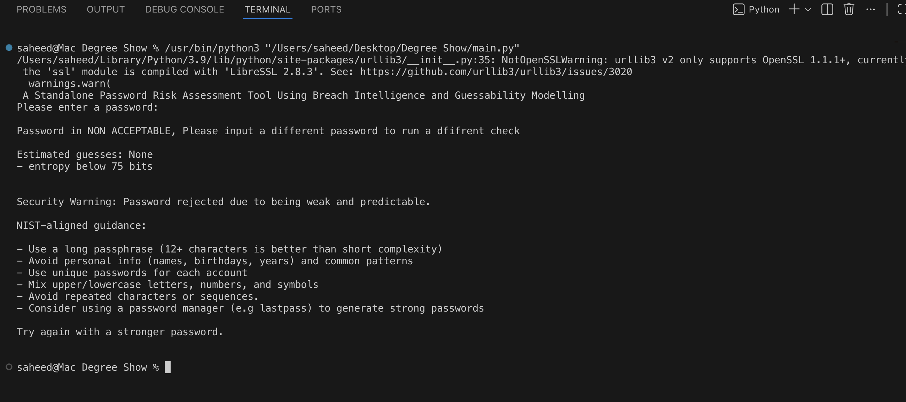
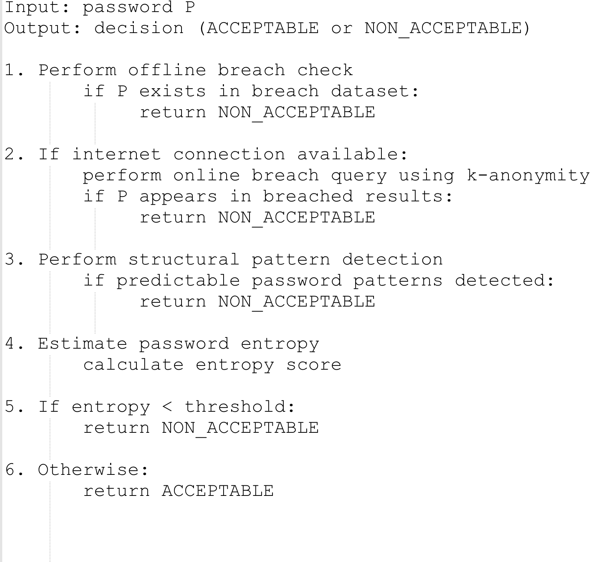
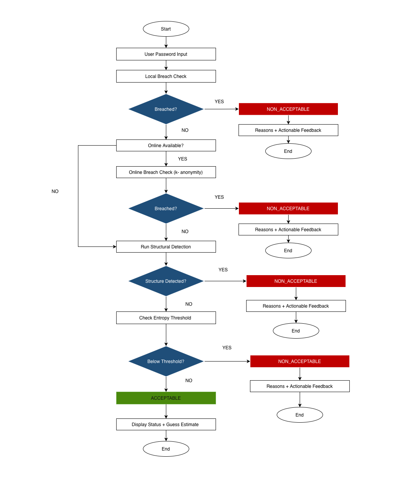

# Password Security Risk Evaluation System

---

## 🧠 Overview

This project is a software-based password security evaluation system designed to assess the strength and risk level of passwords using a multi-layered analysis approach.

Instead of relying only on traditional strength meters such as length, complexity, or entropy, the system evaluates passwords using real-world breach intelligence, structural pattern detection, and entropy estimation. This provides a more realistic assessment of password security based on how attackers actually evaluate credentials.

The goal of this project is to simulate attacker-style password evaluation and identify weaknesses that traditional tools often fail to detect.

---

## ⚠️ Security Context

Traditional password strength meters are limited because they rely heavily on rule-based checks and theoretical entropy scoring. In real-world attacks, however, password compromise is often driven by:

- Previously leaked credential databases
- Predictable human behaviour (names, dates, patterns)
- Password reuse across multiple platforms
- Common keyboard or structural patterns

This project addresses these limitations by combining empirical breach intelligence with structural and theoretical analysis.

---

## 🛠️ System Design & Workflow

The system evaluates passwords through a structured multi-stage pipeline:

### 🔓 1. Breach Intelligence Check
- Compares input passwords against known breached datasets
- Uses the **Have I Been Pwned API** for secure lookup via k-anonymity model
- Immediately flags any password found in real-world data breaches

📌 Example:


---

### 🧩 2. Structural Pattern Detection
- Detects predictable password structures such as:
  - Common dictionary words
  - Sequential patterns (e.g. 123456)
  - Keyboard patterns (e.g. qwerty)
  - User-style predictable formats (names, dates, variations)

📌 Example:


---

### 📊 3. Entropy Estimation
- Calculates password randomness and theoretical complexity
- Evaluates character distribution and variability
- Used as a supporting metric alongside real-world breach analysis

📌 Example:


---

## 🔁 System Pipeline (Pseudocode)

The full evaluation workflow is implemented as a sequential pipeline:

📌 Pseudocode Implementation:



---

## 🏗️ System Architecture

The system is implemented as a modular Python application following a pipeline-based architecture.

It separates control flow from analytical processing to ensure clarity, scalability, and maintainability.

---

### 🧩 Core Modules

- **`main.py`**
  - Handles user input and system execution flow
  - Controls transitions between evaluation stages

- **`guessability.py`**
  - Contains core analytical logic
  - Performs:
    - Breach detection logic
    - Structural pattern analysis
    - Entropy calculation

---

📌 Architecture Diagram:


## 🔁 Hierarchical Assessment Mechanism

The architecture utilizes a hierarchical evaluation model where each password passes through multiple security layers.

---

### 🔐 Layered Security Model

- **Layer 1: Breach Detection**
  - Immediate rejection of passwords found in known compromised datasets

- **Layer 2: Structural Analysis and Entropy Estimation**
  - Detection of predictable patterns and weak structures
  - Evaluation of remaining password complexity using entropy scoring

---

### ⚙️ System Guarantees

This hierarchical approach ensures:

- ✔ Effective rejection of known compromised passwords  
- ✔ Early detection of structurally weak passwords  
- ✔ Reduced reliance on large or exhaustive datasets  
- ✔ Realistic simulation of attacker-style password evaluation  

---

## 💻 Tech Stack

- Python (core logic implementation)
- REST API integration (breach intelligence lookup)
- Have I Been Pwned API (k-anonymity model)
- Rule-based pattern detection engine
- Entropy calculation model
- Modular system architecture design

---

## 📁 Project Structure

```bash
password-risk-system/
│
├── src/
│   ├── main.py
│   ├── guessability.py
│
├── images/
│   ├── breach-check.png
│   ├── pattern-analysis.png
│   ├── entropy-calculation.png
│   ├── pseudocode.png
│   └── system-architecture.png
│
└── README.md
